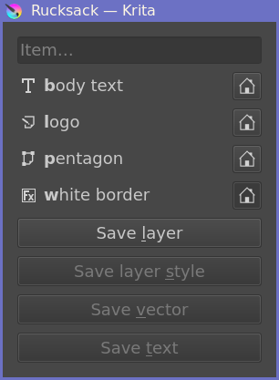

Krita plugin for easy management of entire folders of `*.kra` files.
Supports:
- Importing and exporting images in batch.
- Easy navigation between images.
- Storing reusable components (text styles, layers, vector objects, layer effects)
	in a project- or user-specific “rucksack”.

# Installation

1. Go to Tools → Scripts → Import Python Plugin from Web.
1. Paste in the URL `https://github.com/SabrinaJewson/krita-batch-manager/archive/refs/heads/main.zip`.
1. Restart Krita.
1. Go to Settings → Dockers, and you should be able to check “Batch Manager”.

If on Unix, you may want to use symlinks to keep things up-to-date automatically.
For example:

```sh
git clone https://github.com/SabrinaJewson/krita-batch-manager
cd krita-batch-manager
ln -s "$PWD"/krita_batch_manager* ~/.local/share/krita/pykrita
```

# Usage


Batch Manager will appear as a docker.
You can see it displays a list of all the `.kra` files in the current directory.
You have several buttons available to you:
- The left and right arrows will navigate to the previous and next images respectively.
- The plus button batch-imports several images as `.kra` files in the current folder.
- The refresh icon updates the contents of the list
	(in case you e.g. change the contents of the folder with a means external to Batch Manager).
- The folder icon changes the current folder.
	Note that if you open a `.kra` file, the current folder will always be reset
	to the folder that `.kra` file is in.

For each file in the list:
- Double-click to open it.
- Right-click to delete or rename it.

Below the list, you can configure the export directory and export settings,
which are the same for all the `.kra` files in the list.
Once you have chosen a directory, click the “Export” button to actually perform the export.
Export options can be changed with the button on the right.

If only some `.kra` files have been changed,
export functionality will make sure to only re-export the changed ones.
This makes incremental exports fast.



We also support a rucksack, which allows carrying around
text styles, layers, vector objects and layer effects.
By default, you can press “r” to open it, or access it via Tools → Scripts → Open Rucksack;
either click on the entry or type in the bolded text to insert it into your document.

Like the export configuration, each rucksack is local to the directory in which it’s used –
but you can click the home icon to have individual items be associated with your local user.

To insert items to the rucksack:
- For layers, just open the rucksack while your desired layer is active.
- For layer effects, again open the rucksack while the layer which has the effects is active.
- For vector objects and text, select it before opening the rucksack.

You can shift- or middle-click on entries to insert them while keeping the dialog open.


# Development

Getting started:
- Run `uv sync`.
- Run `touch ~/.local/share/krita/pykrita/krita_batch_manager/dev_mode`.

Useful commands:
- Typechecking: `uv run mypy krita_batch_manager/__init__.py`

License: EUPL
